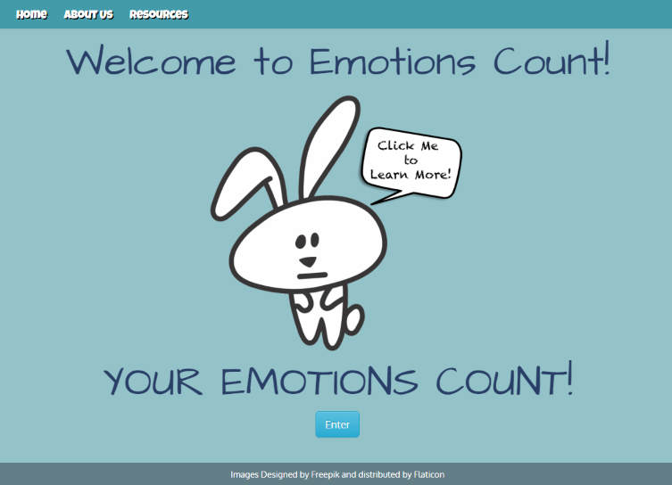
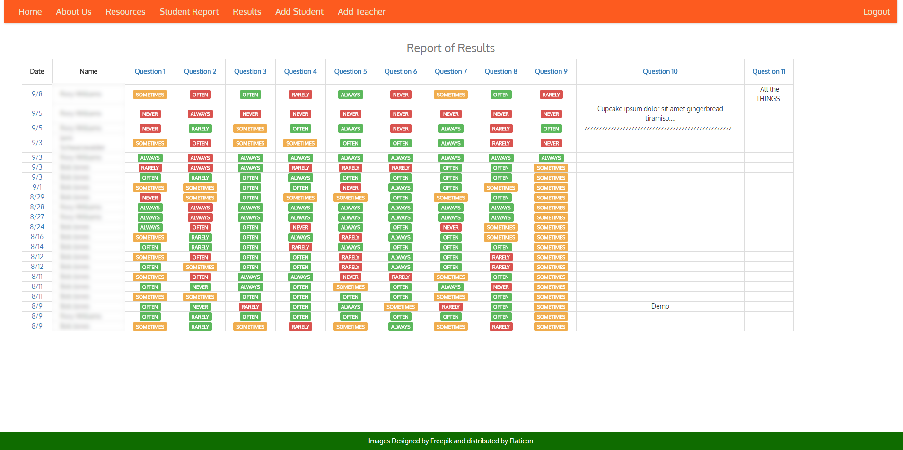
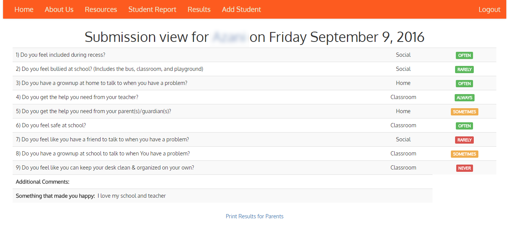
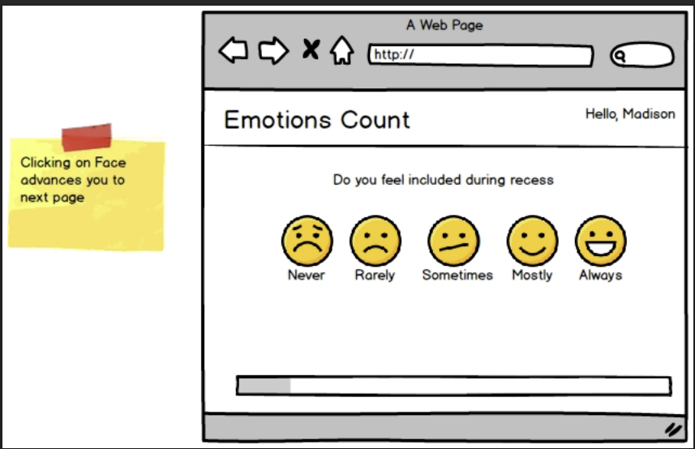
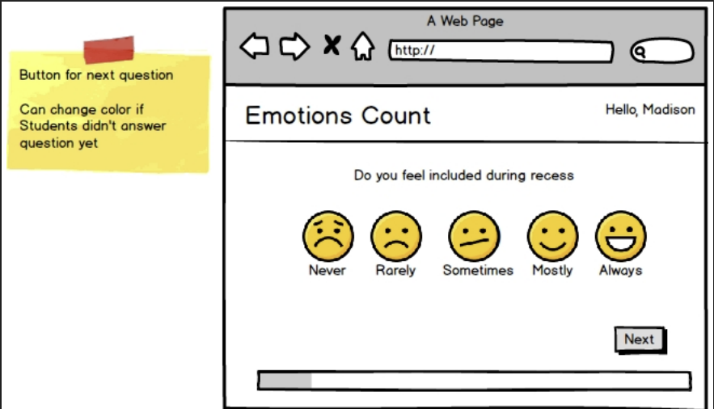
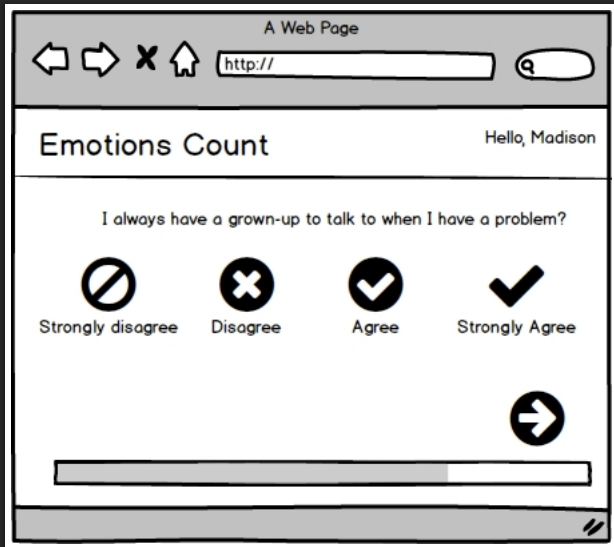
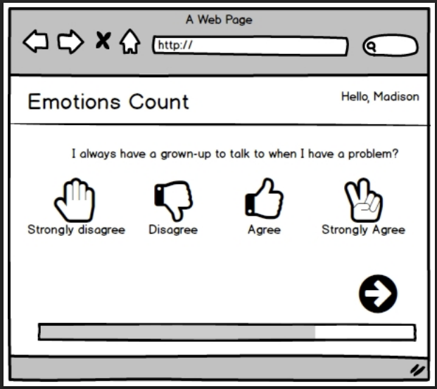

# Emotions Count — UX Research & Educational Technology Case Study

## Overview

Emotions Count was a classroom web application designed to help teachers better understand student emotional check-ins through a simple, low-friction workflow.

The project was developed in collaboration with an educator stakeholder who identified a need for a lower-friction way to understand student emotional well-being while supporting classroom decision-making.

The goal was to create a system that allowed students to quickly share how they were feeling while giving teachers a clear way to identify patterns, monitor classroom trends, and determine when additional support might be needed.

This project explored the intersection of **user experience design, educational technology, data visualization, and human-centered system design.**

---

## My Role

**Lead Developer • UX Researcher • Product Designer**

I was responsible for:

- Translating classroom needs into user workflows
- Facilitating stakeholder discussions through prototypes
- Designing student and teacher experiences
- Building and iterating on the application
- Gathering usability feedback
- Improving workflows based on real-world usage

---

## Problem

Teachers needed a simple way to understand student emotional needs without adding significant effort to already busy classroom workflows.

The system needed to help teachers:

- Collect student check-ins quickly
- Identify students who may benefit from additional support
- Understand classroom-level emotional trends
- Review information efficiently while maintaining privacy

The challenge was balancing **speed, clarity, privacy, and usability** in a classroom environment.

---

## Research & Discovery Process

The project followed an iterative, user-centered development process.

Rather than beginning with a fixed technical solution, we worked with the educator stakeholder to understand the classroom problem, explore possible workflows, and refine the system based on feedback.

The process included:

- Translating classroom needs into user workflows and system requirements
- Creating visual prototypes to explore possible solutions
- Gathering stakeholder feedback throughout development
- Observing real-world usage patterns
- Identifying usability issues and workflow friction
- Iterating on the interface and system behavior based on user needs

This project reinforced the importance of designing systems around actual user environments rather than only technical requirements.

---
## Discovery, Prototyping & Stakeholder Alignment

Before development began, I used low-fidelity prototypes to help transform an early concept into a shared vision between the educator stakeholder and development team.

During the first sprint, I created multiple wireframe concepts using Balsamiq to explore different approaches for student emotional check-ins.

The purpose of these prototypes was not to create polished designs, but to create a fast communication tool that allowed us to:

- Explore multiple possible workflows
- Give the stakeholder concrete examples to react to
- Identify which interactions felt intuitive for students
- Discuss what was technically feasible
- Reduce ambiguity before investing development time

The prototypes helped bridge the gap between an idea described verbally and a system that could be evaluated visually.

Instead of asking the teacher to imagine a future interface, we could discuss specific examples:

"Would this workflow match how students think?"
"Would this information be useful for a teacher?"
"Would this interaction create unnecessary steps?"

This collaborative process helped align three perspectives:

- The educator's classroom goals
- The student's experience using the system
- The technical constraints of building and maintaining the application

  
---

## Final System Screenshots

### Student Experience

The final system provided a simple workflow for students to submit emotional check-ins.

---

### Teacher Dashboard

Teachers could review classroom responses through a dashboard designed to help identify trends and determine when follow-up might be appropriate.

---

### Individual Student View

Teachers could also review response history for individual students to better understand patterns over time.

---

## Solution

I designed and developed a full-stack web application using:

### Tools & Technologies

#### Development
- PHP
- MySQL
- Bootstrap
- jQuery

#### UX & Design
- Balsamiq wireframing and low-fidelity prototyping ([Balsamiq](https://balsamiq.com/))
- Stakeholder review sessions
- Classroom usability feedback

Key system features included:

### Student Experience

- Quick emotional check-in workflow
- Simple interaction model designed for classroom use

### Teacher Experience

- Dashboard for reviewing classroom responses
- Visual indicators to highlight areas requiring attention
- Trend visibility across classroom responses

### System Design

- Parent notification workflows
- Data deletion tools
- Privacy-aware handling of student information

---

## QA & Product Thinking

Throughout development, I approached the system from both a builder and tester perspective.

Key considerations included:

- Could users understand the workflow without additional explanation?
- Were important signals visible quickly?
- Did the interface match classroom realities?
- Where could users become confused or make mistakes?
- How could the system reduce cognitive load for teachers?

---

## Prototype Exploration

### Student Emotional Check-In Wireframes

Early Balsamiq prototypes explored different interaction models for student emotional check-ins.

Four possible approaches were created during Sprint 1 to compare how students might communicate their emotional state. These options helped evaluate clarity, simplicity, and classroom usability before implementation.

---

## Impact

The project:

- Supported teachers in monitoring classroom emotional trends through a structured digital workflow
- Expanded beyond the initial classroom environment
- Incorporated feedback from multiple educators during iterative development
- Demonstrated how user research and rapid prototyping can improve system usability

---

## Sprint Documentation

Additional Sprint 1 documentation includes early exploration of student check-in interactions, error handling, and continuation workflows.

- [Sprint 1: 5 Point Scale Prototype](ec-5-point-scale-prototype.pdf)
- [Sprint 1: Error and Continuation Options](ec-sprint-1-error-continuation-options.pdf)

---

## Presentation & Knowledge Sharing

The Emotions Count project was presented at the **Washington State Applied Baccalaureate Conference** on November 2, 2016, as part of a discussion on the value of real-world student projects.

**Presentation:**
*Green River College: The Value of Real-World Projects*

Presented by:
- Jami Schwarzwalder

Although the project was developed collaboratively, I presented the project independently at the conference, sharing the development process, stakeholder collaboration, prototyping approach, and lessons learned from building a real-world educational technology solution.

The presentation focused on how students worked with community partners to translate real-world needs into usable technology solutions. I discussed the importance of stakeholder communication, iterative design, and balancing user needs with technical constraints.

This experience strengthened my ability to communicate technical projects to broader audiences, including educators, stakeholders, and non-technical decision makers.

## Presentation Materials

- [Washington State Applied Baccalaureate Conference (2016)](washington-state-applied-baccalaureate-conference-2016.pdf)
- Green River College: The Value of Real-World Projects

---

## Key Learnings

This project shaped my approach to UX and product development:

- Real user observation reveals problems that technical requirements often miss
- Low-friction workflows are critical in environments where users are busy
- Good dashboards help people make decisions without overwhelming them
- Privacy and usability must be designed together
- Iterative feedback improves both products and user trust

---

## Project Status & Public References

Emotions Count is no longer an active production system.

The original deployment has been retired, but the project remains available through archived versions and public documentation.

### Archived Website

- Web Archive:  
https://web.archive.org/web/20180117232012/http://emotionscount.com/

### Public Coverage

- Green River College development story:  
https://medium.com/green-river-web-mobile-developers/emotions-count-699aa088f380

- Washington Technology coverage (archived):  
https://web.archive.org/web/20240106115620/https://www.washingtontechnology.org/auburn-teacher-green-river-students-create-web-app-to-measure-kids-emotional-well-being/

- KING 5 News coverage:  
http://www.king5.com/news/local/teacher-creates-students-well-being-app/

---

## Note

Source code is private due to historical repository settings, but this project remains documented as a core example of UX-driven systems design, user research, and product thinking.

---

## Skills Demonstrated

UX Research • User-Centered Design • Usability Testing • Exploratory QA • Product Thinking • Technical Communication • Stakeholder Communication • Public Presentation • Full-Stack Development • System Design • Agile Iteration
